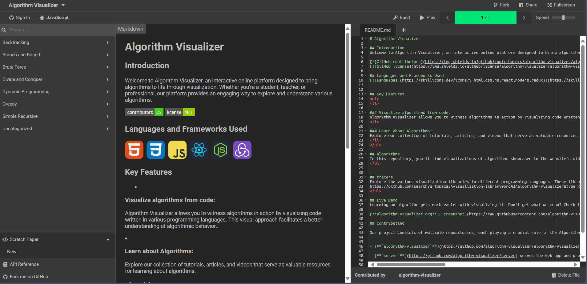

收集了几个学习数据结构的网站。
<!-- more -->

### 1.hello-algo
这是由krahets开源的一个数据结构文档，目前已有接近100k star!
它包括数据结构各类知识点详解与算法图解，可以把它看成一本电子数据结构教材，非常适合大学课程与考研学习，**强烈推荐!**  
链接：https://www.hello-algo.com/

### 2.visualgo
数据结构算法动态可视化。
 
链接：https://visualgo.net/zh

### 3.Data Structure Visualizations
旧金山大学做的一个数据结构可视化网站。 
链接：https://www.cs.usfca.edu/~galles/visualization/Algorithms.html

### 4.Algorithm Visualizer
算法可视化，适合想要钻研数据结构代码的同学。 
链接：https://algorithm-visualizer.org/

### 5.bigocheatsheet
常用算法的时空复杂度。 
链接：https://www.bigocheatsheet.com/

